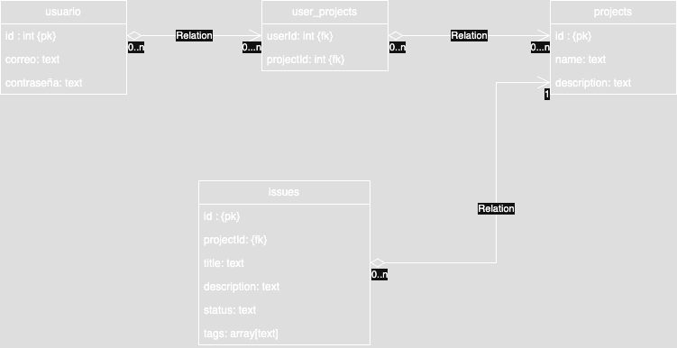

# Issue Tracker – Prueba Técnica

Mini aplicación de gestión de incidencias (Issue Tracker) desarrollada como parte de una prueba técnica para evaluar habilidades full stack.

El objetivo es contar con:
- Un **backend principal** en Node.js + Express que gestione proyectos e incidencias.
- Un **servicio auxiliar en Python** que clasifica issues y genera tags automáticos.
- Un **frontend en React** para interactuar con la API.

> Nota: La evaluación se centra en buenas prácticas, arquitectura y propuestas de diseño, no en completar el 100% de los requisitos.

---

## 🧩 Stack Tecnológico

- **Backend:** Node.js, Express, Axios, SQLite
- **Servicio auxiliar:** Python, FastAPI, Uvicorn
- **Frontend:** React + Vite, Axios
- **Testing:** Jest, Supertest, Vitest + React Testing Library

---

## 🗄️ Diagrama de la Base de Datos

La base de datos SQLite se crea automáticamente al ejecutar el backend (`initDb()`).



---

## 📁 Estructura del Proyecto

```bash
.
├── api-node/
│   ├── backend/
│   │   ├── src/
│   │   │   ├── app.js
│   │   │   ├── index.js
│   │   │   ├── db.js
│   │   │   ├── routes/
│   │   │   │   ├── projects.routes.js
│   │   │   │   └── issues.routes.js
│   │   │   └── services/
│   │   │       └── classifier.service.js
│   │   ├── tests/
│   │   │   ├── app.test.js
│   │   │   ├── projects.routes.test.js
│   │   │   └── issues.routes.test.js
│   │   └── package.json
│   │
│   ├── classifier/
│   │   ├── main.py
│   │   └── README.md
│   │
│   ├── frontend/
│   │   ├── src/
│   │   └── package.json
│   │
│   ├── ARCHITECTURE.md
│   └── GCP_PLAN.md
│
├── docs/
│   └── db_diagram.png
│
└── README.md

```

## 🚀 Cómo ejecutar
```bash

Las instrucciones detalladas se encuentran en:

backend/README.md — Backend Node.js

classifier/README.md — Microservicio Python

frontend/README.md — Cliente web React
```
## Realizado por: Angel Uriel Chávez Morones